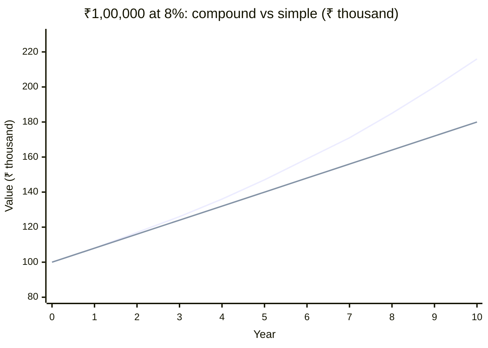

> [!tldr] In one breath
> A rupee today is worth more than a rupee tomorrow, because today's rupee can be put to work earning interest. Compounding moves money **forward** in time; discounting moves it **backward**. Every valuation in finance is built on these two moves.

## Why this matters
You meet this idea every time someone says "pay ₹1,00,000 now, or ₹1,10,000 a year later". Which is better? You cannot answer by comparing 1,00,000 with 1,10,000 — they sit at different points in time. Fixed deposits, EMIs, bond prices, share valuations and insurance maturity quotes are all the same question in disguise.

## The idea
Imagine you hold ₹100 today and a bank offers 8% a year. In a year you have ₹108. So ₹100 today and ₹108 in a year are *equivalent* to you, given that bank. Equivalently, ₹108 promised next year is "worth" only ₹100 today.

Two moves follow from this:

1. **Compounding** — take money today and ask "what will it grow to?" This gives the [[future-value]].
2. **Discounting** — take money in the future and ask "what is it worth today?" This gives the [[present-value]].

The rate that links the two is the [[discount-rate]] (or interest rate). Interest earned *on previous interest* is what makes [[compound-interest]] grow so much faster than simple interest.

> [!definition] Present Value (PV)
> The value today of a cash flow that will arrive in the future, after discounting it at an appropriate rate. See [[present-value]].

> [!formula] Compounding (future value)
> $$FV = PV \times (1 + r)^n$$
> - $FV$ — future value
> - $PV$ — present value (money today)
> - $r$ — interest rate per period
> - $n$ — number of periods

> [!formula] Discounting (present value)
> $$PV = \frac{FV}{(1 + r)^n}$$
> Same equation, rearranged. Discounting is just compounding run in reverse.

When interest is paid $m$ times a year instead of once, the formula becomes:

$$FV = PV \times \left(1 + \frac{r}{m}\right)^{m \cdot n}$$

> [!tip] Rule of 72
> To estimate how long money takes to double, divide 72 by the annual rate in percent. At 9%, $72 / 9 = 8$ years. It is a mental shortcut, not an exact answer.

### Simple vs compound growth
₹1,00,000 at 8% a year. Simple interest adds the same ₹8,000 every year. Compound interest adds 8% of a bigger and bigger balance.

*Chart: the upper line (compound) pulls away from the lower line (simple) every year — by year 10 the gap is about ₹36,000.*

## Worked examples

> [!example] Example 1 — Fixed deposit, how often it compounds
> You put ₹1,00,000 in a deposit at 8% a year for 10 years. Only the compounding frequency differs.
>
> | Compounding | Periods ($m \cdot n$) | Value after 10 years |
> |---|---|---|
> | Yearly | 10 | ₹2,15,892 |
> | Half-yearly | 20 | ₹2,19,112 |
> | Quarterly | 40 | ₹2,20,804 |
> | Monthly | 120 | ₹2,21,964 |
> | Daily | 3,650 | ₹2,22,535 |
>
> The more often interest is added, the more you earn — but the gains shrink fast. Going from yearly to monthly adds about ₹6,000; going from monthly to daily adds only about ₹570.

> [!example] Example 2 — Discounting a promise
> A friend promises you ₹1,10,000 one year from now. Your bank pays 8%. What is the promise worth today?
>
> $$PV = \frac{1{,}10{,}000}{1.08} \approx 1{,}01{,}852$$ (in ₹)
>
> So you should accept ₹1,01,852 today in place of that promise, but not ₹1,00,000 if you can find the money elsewhere at 8%.

## Practice problems

**Problem 1.** You invest ₹2,00,000 in a deposit paying 7% a year, compounded yearly. What is it worth after 5 years?

> [!solution]- Solution
> $FV = 2{,}00{,}000 \times (1.07)^5$
>
> $(1.07)^5 \approx 1.40255$
>
> $FV \approx 2{,}80{,}510$ rupees (₹2,80,510)

**Problem 2.** You need ₹10,00,000 in 5 years for a down payment. If you can earn 12% a year, how much must you invest today?

> [!solution]- Solution
> $PV = \dfrac{10{,}00{,}000}{(1.12)^5}$
>
> $(1.12)^5 \approx 1.76234$
>
> $PV \approx 5{,}67{,}427$ rupees (₹5,67,427)

**Problem 3.** At 9% a year, how long does money take to double? Give the exact answer and the Rule of 72 answer.

> [!solution]- Solution
> Exact: solve $(1.09)^n = 2$, so $n = \dfrac{\ln 2}{\ln 1.09} \approx 8.04$ years.
>
> Rule of 72: $72 / 9 = 8$ years.
>
> The shortcut is off by less than a week here, which is why it is popular.

## In practice

> [!in-practice] Where you'll see this
> - **Bank FDs** quote an annual rate but often compound quarterly — so the *effective* yield is a little higher than the headline rate.
> - **Loan EMIs** are monthly compounding run in reverse: the bank discounts your future payments to equal the loan today.
> - **Bond prices** fall when interest rates rise, because the same future coupons get discounted at a higher rate.
> - **RBI rate decisions** change the baseline rate everyone uses to discount; that is why markets react so strongly to them.

> [!critical] Common misconception
> "8% a year for 10 years is 80% in total." It is not — that is *simple* interest. Compounding gives about 116% in total ($1.08^{10} - 1$). Likewise, "double the rate, double the result" is false for compounding; the result grows much more than twice.

> [!warning] Compare like with like
> A rate quoted "per annum, compounded monthly" is not the same as one "per annum, compounded yearly". Always check the compounding frequency before comparing two offers.

## Check yourself

> [!question]- Why does a higher discount rate lower present value?
> Because the discount rate is the return you could earn elsewhere. The higher it is, the less you need to invest *today* to reach the same future amount — so the same future cash is worth less today.

> [!question]- Is ₹1,00,000 today always better than ₹1,00,000 a year from now?
> Almost always, when positive interest or return is available (and ignoring risk or inflation differences). The only exception is if the discount rate is zero or negative.

> [!question]- In Example 1, why do gains from more frequent compounding shrink?
> Each extra compounding step adds a tiny slice of interest-on-interest. The total approaches a limit — continuous compounding, $PV \times e^{rn}$ — that you cannot exceed.

## My Take

> [!my-take] My Take
> _Your thoughts go here: what clicked, what still confuses you, how you'd explain it to a friend. For example: when did you last choose between money now and money later?_

## Go deeper

> [!recommendation] Next steps
> - Next topic to learn: *inflation and real vs nominal returns* (coming soon in [[finance/01-foundations/index|Foundations]]).
> - Practise: take any FD offer from your bank's website and compute its effective annual yield by hand.
> - Look up the definitions: [[future-value]], [[present-value]], [[compound-interest]], [[discount-rate]].

## Related
- [[present-value]]
- [[future-value]]
- [[compound-interest]]
- [[discount-rate]]
