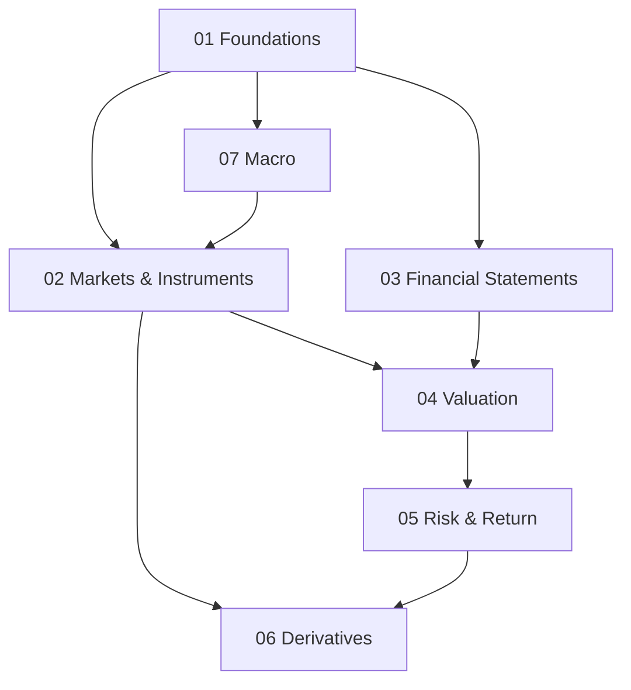

Welcome. This is a personal notebook for learning how financial markets work — built up one idea at a time, from intuition to formula to worked example to practice. Every note has a **My Take** box where I write down what I actually think.

## Learning map

## Sections

| # | Section | Status |
|---|---|---|
| 01 | [[finance/01-foundations/index\|Foundations]] | Started |
| 02 | [[finance/02-markets-instruments/index\|Markets & Instruments]] | Planned |
| 03 | [[finance/03-financial-statements/index\|Financial Statements]] | Planned |
| 04 | [[finance/04-valuation/index\|Valuation]] | Planned |
| 05 | [[finance/05-risk-return/index\|Risk & Return]] | Planned |
| 06 | [[finance/06-derivatives/index\|Derivatives]] | Planned |
| 07 | [[finance/07-macro/index\|Macro]] | Planned |

Start here: [[finance/index|Finance — learning path]], then [[01-time-value-of-money|Time Value of Money]].

## More
- [[CHANGELOG|What changed, and when]]
- [[meta/style-guide|Style guide]] — every side box and chart type
- [[meta/how-this-works|How this site works]]
