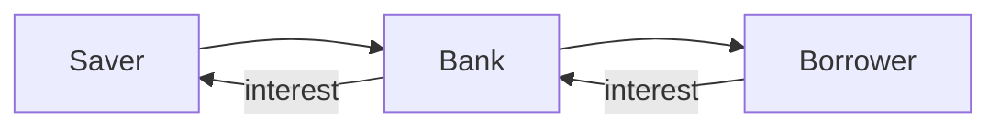
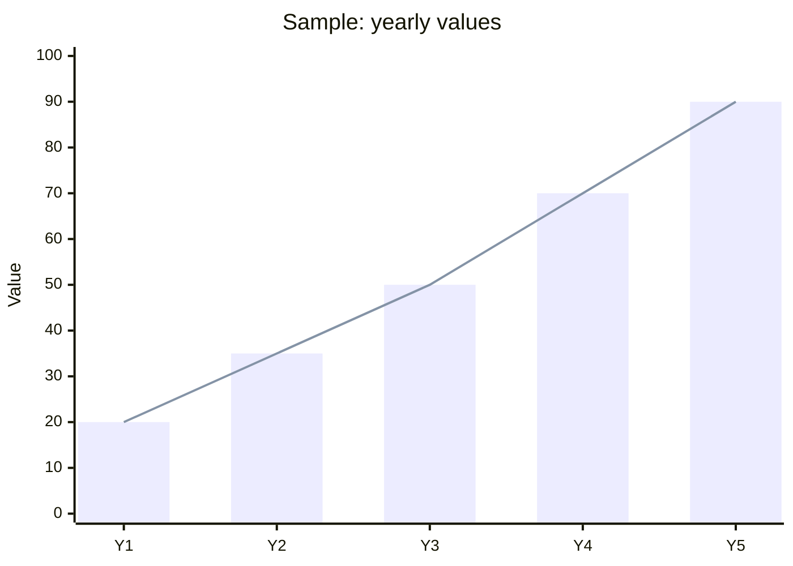

This page shows every building block. If something looks broken here, it is broken everywhere.

## Side boxes

> [!note] Note
> Side note or extra context.

> [!tip] Tip
> A practical shortcut or rule of thumb.

> [!warning] Warning
> A caution or common trap.

> [!example] Example
> A worked example (shown open).

> [!question] Question
> A self-check question.

> [!quote] Quote
> "Compound interest is the eighth wonder of the world." — often attributed to Einstein (probably apocryphal)

> [!tldr] TL;DR
> A short summary at the top of a note.

> [!my-take] My Take
> The owner's own thinking. The most prominent box on the page. Never collapsed, never written on his behalf.

> [!recommendation] Recommendation
> What to read, do or practise next.

> [!critical] Critical
> A must-understand concept or a dangerous misconception.

> [!definition] Definition
> The formal definition of a term.

> [!formula] Formula
> $$PV = \frac{FV}{(1 + r)^n}$$
> - $PV$ — present value
> - $FV$ — future value
> - $r$ — discount rate per period
> - $n$ — number of periods

> [!in-practice] In practice
> How this shows up in real markets — an RBI decision, a Nifty move, a Fed meeting.

> [!solution]- Solution (collapsed by default)
> Click the title to open and close. Used for every practice problem.

## Math
Inline: the return is $r = \frac{P_1 - P_0}{P_0}$.

Block:

$$\sigma = \sqrt{\frac{1}{N-1}\sum_{i=1}^{N}(r_i - \bar{r})^2}$$

## Table

| Instrument | Typical risk | Typical horizon |
|---|---|---|
| Savings account | Very low | Any |
| Fixed deposit | Low | 1–5 years |
| Equity index fund | Medium–high | 7+ years |

## Diagram (Mermaid)

*Diagram: banks sit between savers and borrowers and pass interest back.*

## Chart (Mermaid xychart)

*Chart: a bar and a line over the same five points.*

## Richer chart (hand-written SVG)

![[sample-payoff.svg]]
*Chart: payoff at expiry of a long call option struck at 100 — flat loss until the strike, then rising one-for-one.*
