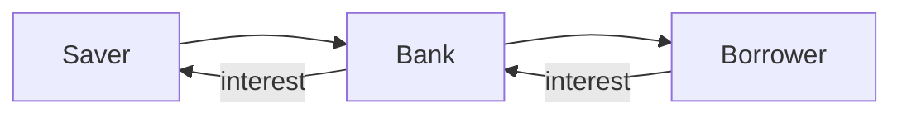

This page shows each building block. If something looks wrong here, it is wrong everywhere. Toggle light and dark mode to check both.

## Side boxes

> [!note] Note
> Side note or extra context.

> [!tip] Tip
> A practical shortcut or rule of thumb.

> [!warning] Warning
> A caution or common trap.

> [!example] Example
> A worked example, shown open.

> [!question] Question
> A self-check question.

> [!quote] Quote
> A short quote with attribution.

> [!tldr] In one breath
> A short summary at the top of a note.

> [!my-take] My Take
> Your own thinking. The most prominent box on the page. Never collapsed.

> [!recommendation] Recommendation
> What to read, do or practise next.

> [!critical] Critical
> A must-understand concept or a dangerous misconception.

> [!definition] Definition
> The formal definition of a term.

> [!formula] Formula
> $$PV = \frac{FV}{(1 + r)^n}$$
> - $PV$: present value
> - $FV$: future value
> - $r$: discount rate per period
> - $n$: number of periods

> [!in-practice] In practice
> How this shows up in real markets, such as an RBI decision or a Nifty move.

> [!solution]- Solution (collapsed by default)
> Click the title to open and close. Used for every practice problem.

## Math

Inline: the return is $r = \frac{P_1 - P_0}{P_0}$.

$$\sigma = \sqrt{\frac{1}{N-1}\sum_{i=1}^{N}(r_i - \bar{r})^2}$$

## Table

| Instrument | Typical risk | Typical horizon |
|---|---|---|
| Savings account | Very low | Any |
| Fixed deposit | Low | 1 to 5 years |
| Equity index fund | Medium to high | 7+ years |

## Diagram (Mermaid)


*Diagram: banks sit between savers and borrowers and pass interest back.*

## Code

```js
const fv = (pv, r, n) => pv * Math.pow(1 + r, n)
console.log(fv(100000, 0.08, 10)) // 215892.5
```

See also [[tools/echarts-examples|ECharts examples]] and [[tools/tradingview-examples|TradingView examples]].
